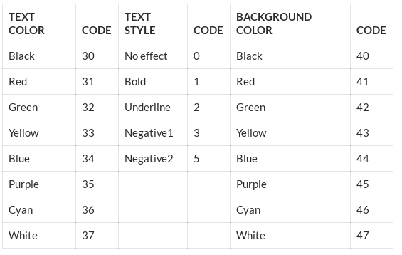

<pre>
not as root
git the repo
git clone nameOfrepo.git
git add --all
git commit -m "added all"
git push

</pre>

# python
<h3>
As of 170920 we are using the following reference:
http://anh.cs.luc.edu/python/hands-on/3.1/handsonHtml/functions.html

<a href = "http://anh.cs.luc.edu/python/hands-on/3.1/handsonHtml/functions.html" target = "_blank"> Hand On Python </a>
</h3>
<pre>
Ptyhon Text Colour

print("\033[1;32;40m Bright Green  \n")
 

The above ANSI escape code will set the text colour to bright green. The format is;
\033[  Escape code, this is always the same
1 = Style, 1 for normal.
32 = Text colour, 32 for bright green.
40m = Background colour, 40 is for black.
</pre>
This table shows some of the available formats;

</pre>
<pre>
Python grapbics.py

</pre>

<pre>
Here are some git commands so you can pull python resources from this repo

git config --global --list
user.user=icebowl
user.username=icebowl
user.email=???

git config --global user.user "username"
git config --global user.username "username"
git config --global user.email "?@?"

repo commands
git add --all
git commit -m "aa"
git push
</pre>
